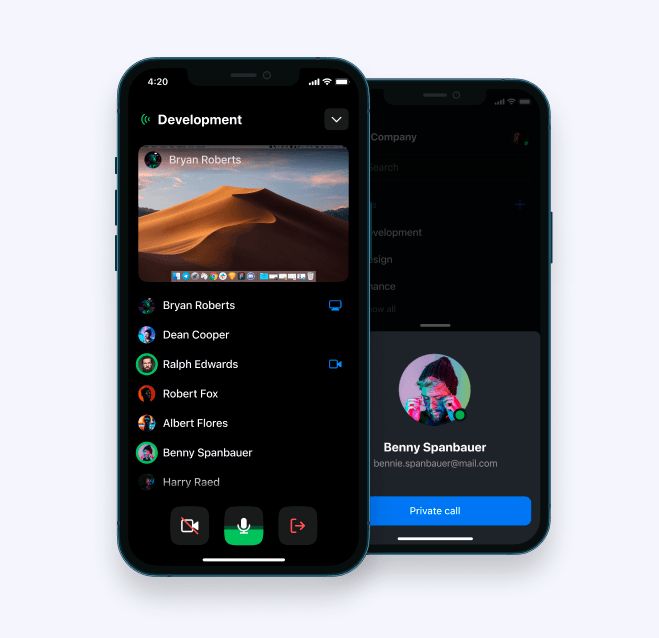
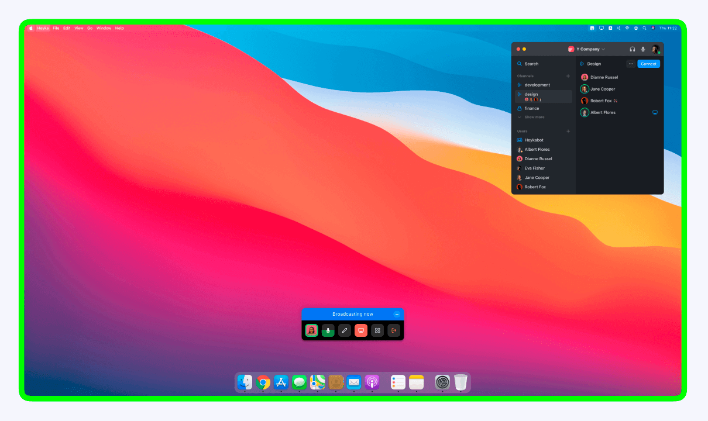
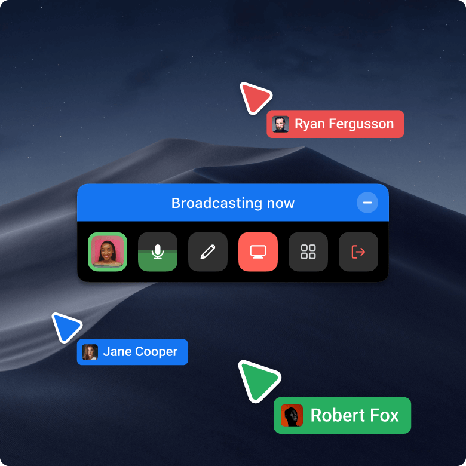

## **Heyka**
## A desktop app for video- and audio-conferencing

---

## What is Heyka?
Heyka is an audio- and video-conferencing app made with the b2b sector in mind: create a workspace for your company, invite colleagues, create thematic rooms for them which they can freely join and leave at any time.
Closest famous comparison would be Discord, but just more business-oriented.

## What technologies are used?
It is a cross-platform desktop app made with the help of **Electron**. Yes, it eats more RAM than desired, but the bundle size is reasonable, and CPU usage is low — lower than all other popular competitors.

- Frontend: **Electron**, **Vue+Vuex**, **Stylus**
- Backend: **NodeJS**, **Hapi.js**, **Redis**, **Postgres**
- WebRTC: **Janus**

We also had separate mobile apps for iOS & Android, but they were still in early beta and will most likely not be part of this open source project.

  
Mobile screenshot

&nbsp;

## Compatibility
Heyka is compatible with macOS, Windows and Linux. No guarrantees for special versions, but should work fine with Windows 10 and macOS Mojave/Catalina/Big Sur/Monterey.

---

## Structure
There are 4 main repositories for Heyka:
- [heyka](https://github.com/cmtt-ru/heyka) – main desktop app part
- [heyka-web](https://github.com/cmtt-ru/heyka-web) – website frontend part (admin panel, landing, social login, downloads, etc.)
- [heyka-sdk](https://github.com/cmtt-ru/heyka-sdk) – common pages and components for app and web part
- [heyka-backend](https://github.com/cmtt-ru/heyka-backend) – backend part

## Functionality

Probably the best way to explore the functionality of Heyka is to set up this project and see for yourself!.. Mainly because of its extensive size.

**But we’ll write out a dozen of features:**

&#8291;**1.** Heyka is small! Small in visual size, small in CPU usage.

&nbsp;

&#8291;**2.** You can create workspaces and invite people to them

&#8291;**3.** Users can create private channels in workspaces, admins can also create public channels

&#8291;**4.** Anyone with enough rights can connect to a channel any time, voice only or with camera

&nbsp;

&#8291;**5.** You can connect to a specific channel from a web browser as a guest, as long as you have an invitation link

&#8291;**6.** In channels people can share their screen – and others can draw over it, with their cursors visible when moving. Really useful to point at some parts of the screen or explain something in a pinch.

  
Screenshots

&nbsp;

&#8291;**7.** Temporary chat function during the call (works like chat in Zoom)

&nbsp;

&#8291;**8.** Push messages with invitations to calls

&nbsp;

&#8291;**9.** Login with social networks or by login/pass

&#8291;**10.** Call directly anyone from your team, creating a temporary private channel

&#8291;**11.** Integrate with slack, inviting people to a workspace or to a call if they are already in a workspace

&#8291;**12.** Change app theme (dark/light) and app language (ru/en) on the fly

&#8291;**13.** Manage users and their roles in a web-hosted admin interface

&nbsp;

# Project setup

## [Read here](https://github.com/cmtt-ru/heyka/blob/master/SETUP.md)

&nbsp;

# Contribution
Heyka is in a limbo right now: we won't accept new requests right now, but we made sure it is possible for anyone to fork this project and use it for themselves. We hope that someday Heyka will gain its second life, and we would be happy to continue the development.

For the time being, the only contributors are the original developers of Heyka at [cmtt.ru](https://cmtt.ru):

 [Ivan Bushmin](https://github.com/bushmin) - frontend

 [Michael Nalbandyan](https://github.com/xinger) - frontend

 [Evgenii Korolev](https://github.com/ekorolev) - backend

 [Ilya Chekalsky](https://github.com/chekalsky) - infrastructure

 [Murod Khaydarov](https://github.com/khaydarov) - infrastructure

 [Kostya Zakharenko](https://dribbble.com/kostya-zakharenko) - design

&nbsp;
&nbsp;
# License

Copyright Ⓒ 2020-present [Komitet](https://cmtt.ru)